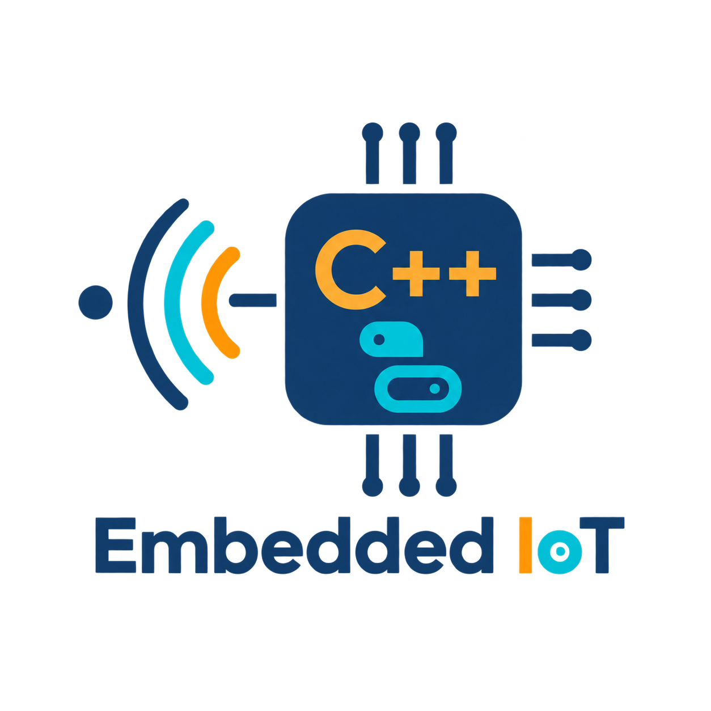
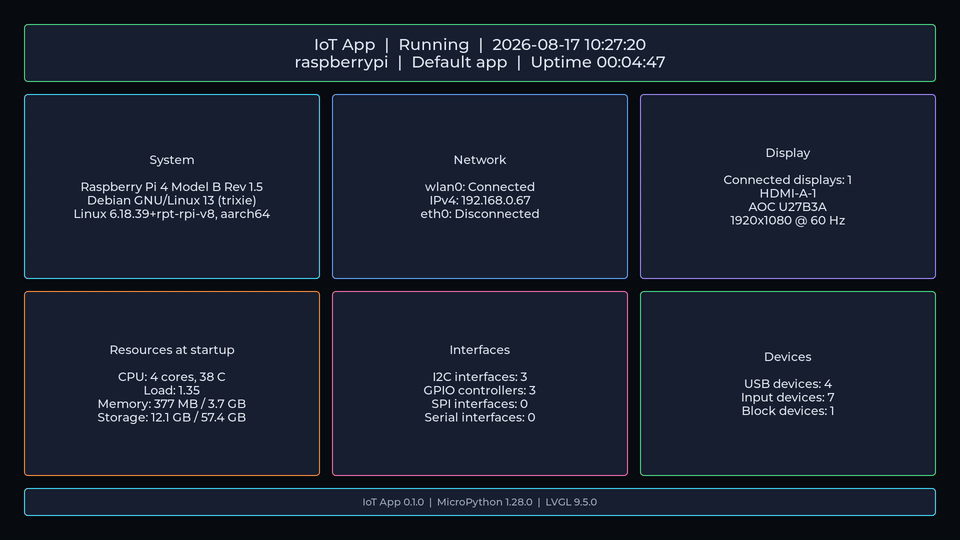

<p align="center">
  
</p>

# Embedded IoT Project

This project runs small MicroPython applications inside a C++ runtime on a
Raspberry Pi. The final device does not need a separate Python installation:
MicroPython and the project-owned Python modules are compiled into the C++
application.

The runtime draws directly to the Linux framebuffer with LVGL, reads Linux
system information, supports an Adafruit I2C gamepad, and receives replacement
Python applications over MQTT. A new Python application can replace the
current one without restarting the C++ process. If a Python application fails,
the C++ runtime stops it and shows an emergency error screen until another
valid application arrives or the runtime restarts.

## Project History

I started this project about a year before its first public release, alongside
several other personal C++ projects. It became a much longer project than I
first expected because it required me to learn and combine several unfamiliar
areas, including LVGL, Linux system interfaces, Raspberry Pi hardware, and
custom Linux images built with Buildroot and Yocto.

The first version was a small prototype. Over the following year, I extended
and refactored it several times as I learned more and tested different designs.
I learned from public documentation, tutorials, open-source code, GitHub
projects, and other online resources along the way. I also used AI tools to
help rewrite some of the documentation and review parts of the code.

The current version represents roughly a year of development and hands-on
testing with a Raspberry Pi 4 Model B. I decided to make it public so that
others can use it, learn from it, and suggest improvements. If you find a
problem, have an idea, or have difficulty building it on your system, please
open an issue and let me know.

## Demo

The demo below shows IoT App running on a Raspberry Pi and displaying its
MicroPython system dashboard.



## How the parts fit together

```text
Ubuntu computer                       Raspberry Pi

iot_app_sender
      |
      | Python application over MQTT
      v
MQTT broker* -----------------------> iot_app C++ runtime
                                           |
                                           +--> Embedded MicroPython
                                           |        |
                                           |        +--> IoT Python modules
                                           |
                                           +--> Linux system and I2C hardware
                                           |
                                           +--> ScreenManager render thread
                                                    |
                                                    v
                                             LVGL -> /dev/fb0 -> HDMI
```

Note: the MQTT broker can run on the Raspberry Pi, the Ubuntu computer, or
another machine that both sides can reach.

The C++ runtime owns hardware access, application lifetime, error handling, and
rendering. Python applications describe what appears on the screen and use the
native `iot` modules supplied by the runtime.

## Repository layout

| Path | Purpose |
|---|---|
| [`iot_app/`](iot_app/) | C++ runtime, embedded MicroPython modules, default dashboard, tests, and image integration |
| [`iot_app_sender/`](iot_app_sender/) | Ubuntu command-line tool that sends Python applications over MQTT |
| [`iot_app_sender/sample_applications/`](iot_app_sender/sample_applications/) | Runnable examples for displays, timers, system information, and the I2C gamepad |
| [`meta-iot-app/`](meta-iot-app/) | Project-owned Yocto layer, image recipe, services, and Raspberry Pi configuration |
| [`scripts/build/`](scripts/build/) | Small scripts used by the root Makefile to prepare Buildroot and Yocto builds |
| `micropython/` | Pinned upstream MicroPython submodule |
| `lvgl/` | Pinned upstream LVGL submodule |
| `buildroot/` | Pinned upstream Buildroot submodule |
| `poky/` | Pinned Yocto/Poky reference distribution submodule |
| `meta-openembedded/` | Pinned OpenEmbedded package layer submodule |
| `meta-raspberrypi/` | Pinned Raspberry Pi Yocto BSP layer submodule |

The upstream submodules are build dependencies. Project-specific files live
under `iot_app/`, `iot_app_sender/`, `meta-iot-app/`, and `scripts/`.

## Project commands

The root [`Makefile`](Makefile) provides short commands for common development
work. Run `make help` to see the available targets.

| Command | What it does |
|---|---|
| `make submodules` | Initialize all upstream submodules at the revisions pinned by this repository |
| `make format` | Format the project C and C++ source files with `clang-format` |
| `make format-check` | Check C and C++ formatting without changing any files |
| `make iot-app` | Configure and build IoT App for the current Linux computer |
| `make test` | Configure, build, and run all unit tests |
| `make coverage` | Run the tests and create terminal, HTML, and XML coverage reports |
| `make wifi-prepare` | Create the shared private Wi-Fi configuration when it is missing |
| `make storage-check` | Check the shared root and data partition sizes |
| `make buildroot-prepare` | Create the persistent Buildroot directories and load the current Raspberry Pi 4 configuration |
| `make buildroot-app` | Cross-compile and install only IoT App into the Buildroot target directory |
| `make buildroot-image` | Rebuild the latest IoT App and generate the complete Raspberry Pi SD-card image |
| `make yocto-prepare` | Create the persistent Yocto directories, refresh its configuration, and copy private Wi-Fi and SSH files |
| `make yocto-check` | Parse the Yocto layers and image configuration without compiling an image |
| `make yocto-app` | Cross-compile only the IoT App Yocto package |
| `make yocto-image` | Build a complete Yocto image and prepare it for Raspberry Pi Imager |
| `make images` | Build both the Buildroot and Yocto Raspberry Pi images |

Both image builders also look for an optional root-level
`ssh_authorized_keys` file. When that file exists and is not empty, its public
keys are installed for passwordless root SSH access. The personal file is
ignored by Git; [`ssh_authorized_keys.example`](ssh_authorized_keys.example)
shows the expected format.

The formatting commands cover the application headers, native MicroPython
modules, runtime sources, and unit tests. They use [`iot_app/.clang-format`](iot_app/.clang-format).
If the executable has a versioned name on your system, pass it explicitly:

```bash
make format-check CLANG_FORMAT=clang-format-18
```

Buildroot and Yocto keep their output outside `/tmp` by default:

```text
/opt/iot-app-builds/
├── buildroot-raspberry-pi-4/
├── yocto-raspberry-pi-4/
├── yocto-downloads/
├── yocto-sstate-cache/
├── yocto-sources/
└── images/
```

The first image command may ask for the user's `sudo` password so the
preparation scripts can create these directories and give them to the current
user. Later builds reuse downloaded source, toolchains, compiled packages, and
cached results.

Buildroot and Yocto read [`storage_layout.conf`](storage_layout.conf). Each
image has the fixed root-partition size selected in that file. The data
partition expands to the end of the SD card on first boot and is mounted at
`/data`.
See the [storage layout guide](iot_app/docs/storage/README.md)
for the partition map, size overrides, first-boot steps, and upstream
references.

The output location can be changed without editing the Makefile:

```bash
make buildroot-image \
  BUILDROOT_OUTPUT=/opt/iot-app-builds-custom/buildroot-raspberry-pi-4
```

The selected Buildroot path must not contain an `@` character.
`buildroot-image` is used for both the first complete build and later image
refreshes. It does not flash the image to an SD card. The
[Yocto image guide](iot_app/docs/yocto/README.md) explains the corresponding
Yocto paths and commands.

## Quick start on Raspberry Pi OS

Install the native dependencies:

```bash
sudo apt update
sudo apt install \
  build-essential cmake pkg-config \
  libdrm-dev libmosquitto-dev libcjson-dev libssl-dev \
  mosquitto mosquitto-clients
```

Initialize the required submodules, then build from the repository root:

```bash
make submodules
make iot-app
```

Run the application from a Linux console where `/dev/fb0` is available:

```bash
./build/iot_app/iot_app
```

IoT App uses the active Linux framebuffer resolution; it does not change the
monitor mode. See the [IoT App guide](iot_app/README.md) for permissions,
logging, MQTT defaults, console-mode setup, and deployment instructions.

## Python applications

The shipped dashboard is kept in
[`iot_app/default_python_application/`](iot_app/default_python_application/).
CMake, Buildroot, and Yocto install this same copy on the Raspberry Pi.

Developers can send another application from Ubuntu with
[`iot_app_sender/send_app.py`](iot_app_sender/send_app.py). The
[sample application catalog](iot_app_sender/sample_applications/README.md)
contains clocks, gamepad demonstrations, system dashboards, and deliberate
failure examples.

The default dashboard can also be sent over MQTT to restore it without
restarting the C++ runtime. The
[default-dashboard recovery guide](iot_app_sender/sample_applications/default_dashboard/README.md)
explains how.

Received Python source is currently treated as trusted code. Authentication,
TLS, MQTT access control, and package signatures must be added before accepting
applications from an untrusted network or sender.

## Tests and coverage

Build and run the tests:

```bash
make test
```

Use `make coverage` to print coverage in the terminal and generate
`build/iot_app_coverage/coverage/index.html` and `coverage.xml`.
Install `gcovr` first if it is not already available:

```bash
sudo apt install gcovr
```

Unit tests cover code that can run without a real Raspberry Pi, including
parsers, queues, state changes, deployment rules, and hardware-driver logic.
Tests that use real DRM, `/dev/fb0`, I2C hardware, an MQTT broker, or a complete
device workflow are integration tests and should run separately on a suitable
Linux system or Raspberry Pi.

The coverage command requires at least 90% line coverage across all included
project files together. It does not require every individual source file to
reach 90%. Low-level operating-system interfaces remain internal testing
details rather than part of the main application architecture.

## Documentation

Each guide has one main purpose. Start here for the project overview, use the
IoT App README for normal runtime work, and use the more focused guides for the
API, deployment, hardware, Buildroot, or Yocto.

| Document | What it covers |
|---|---|
| [IoT App](iot_app/README.md) | Runtime structure, local build, execution, logging, and installation |
| [System design](iot_app/docs/system-design/README.md) | Component responsibilities, threads, application lifetime, rendering, and MQTT deployment |
| [LVGL guide](iot_app/docs/lvgl/README.md) | Introduction to LVGL and the project's framebuffer, widget, and render-thread design |
| [MicroPython API](iot_app/docs/micropython-api/README.md) | Native `iot` modules, required and optional arguments, return values, and examples |
| [Hardware](iot_app/docs/hardware/README.md) | Adafruit gamepad button wiring and mask conversion |
| [Device image](iot_app/docs/device-image/README.md) | Shared Wi-Fi, SSH, mDNS, services, device checks, and troubleshooting |
| [Buildroot](iot_app/docs/buildroot/README.md) | Buildroot preparation, image build, flashing, package updates, and Buildroot-specific problems |
| [Yocto](iot_app/docs/yocto/README.md) | Yocto layers, preparation, image build, flashing, updates, and BitBake-specific problems |
| [Image storage](iot_app/docs/storage/README.md) | Shared root and `/data` partition sizes, first-boot expansion, and verification |
| [Development executable](iot_app/docs/development-executable/README.md) | Test a rebuilt executable from `/data` without replacing the installed copy |
| [IoT App Sender](iot_app_sender/README.md) | Ubuntu sender installation, configuration, MQTT topics, and status replies |
| [Sample applications](iot_app_sender/sample_applications/README.md) | Available Python examples and their hardware requirements |
| [Raspberry Pi OS](iot_app/docs/raspberry-pi-os/README.md) | Raspberry Pi OS configuration notes used during development |

## Main technology choices

- Embedded MicroPython for user applications
- LVGL 9 with the Linux framebuffer backend
- DRM/KMS for display discovery
- Linux I2C for hardware access
- MQTT 5 with Mosquitto for application deployment
- Buildroot or Yocto for a complete Raspberry Pi image
- GoogleTest and Google Mock for automated tests

## License

The original IoT App code and documentation are available under the
[PolyForm Noncommercial License 1.0.0](LICENSE). Personal projects, hobby
projects, study, research, education, and other non-commercial uses are
permitted. You may publish a non-commercial project that uses or modifies this
code, but you must include the license and its required notices.

Commercial or industrial use is not included. A company or individual that
wants to use this project for a commercial product, paid service, internal
business system, or other commercial purpose must first obtain a separate
written license from the copyright holder. Contact the repository owner through
[GitHub](https://github.com/arabnejad) to discuss commercial permission.

This is a source-available project rather than an OSI-approved open-source
project because the license restricts commercial use. Buildroot, LVGL,
MicroPython, and other third-party components keep their own licenses. Their
license files and notices remain in their respective source directories.
